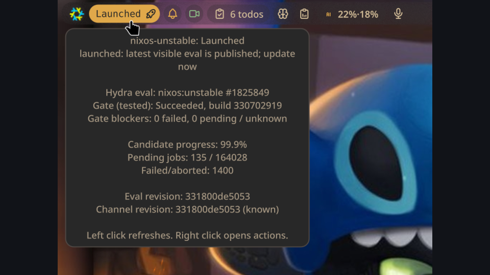

# Hydra Update Examiner

Noctalia bar widget for estimating how close a NixOS or Nixpkgs channel is to advancing.



The widget queries Hydra on demand, without a daemon, and displays a channel-readiness score. It does not treat all Hydra jobs as equal: when a channel gate exists, it weights that gate and its constituent blockers more heavily than the candidate eval queue.

Hydra Update Examiner uses Hydra's JSON API for evaluation metadata, channel-gate
build status, and gate constituent counts. Candidate-wide progress still reads
Hydra's evaluation summary page because the JSON evaluation payload exposes the
full build-id list, not the grouped queued/succeeded/failed summary. This keeps
the widget fast while avoiding the most fragile page scraping.

## What It Shows

- Candidate Hydra eval queue progress.
- Health-adjusted all-job score.
- Exact channel-gate status for the latest eval.
- Constituent failed/pending blocker counts from the channel-gate build page when available.
- Current public channel revision from `channels.nixos.org`.

`100%` means Hydra appears done with the candidate and the channel should publish soon. Once the newest visible eval is already the public channel revision, the widget changes from a percentage to `Launched`. The tooltip distinguishes:

- `imminent: channel gate passed; waiting for channel publication`
- `launched: latest visible eval is published; update now`

If the channel gate has passed but the candidate eval still has queued jobs, the widget stays below `100%` and reports `close: channel gate passed; candidate eval queue still draining`.

The queued job count is not Hydra's global queue. It is the queue for the candidate evaluation currently being examined. Hydra can keep building unrelated global jobs forever; the candidate eval queue must drain before that candidate can publish.

When the channel gate fails or dependency-fails, the visible score is capped and weighted by the blocker count instead of global queue completion.

## Dependencies

Requires Noctalia `4.6.6` or newer.

Runtime commands:

- `bash`
- `curl`
- `jq`
- `perl`
- `grep`
- `awk`
- `sed`
- `timeout`
- `xdg-open`

On NixOS, `bash`, `perl`, `grep`, `awk`, `sed`, and `timeout` are normally present. Add `curl`, `jq`, and `xdg-utils` if needed.
The installer also expects standard GNU userland tools such as `cp`, `mv`, `rm`, `realpath`, and `mktemp`.

Example:

```nix
environment.systemPackages = with pkgs; [
  curl
  jq
  xdg-utils
];
```

## Network And Privacy

The widget is a status monitor for public infrastructure. It does not use credentials, does not send POST requests, and does not run a background daemon.

It performs read-only `GET` requests to:

- `https://hydra.nixos.org`
- `https://channels.nixos.org`
- `https://nix-channels.s3.amazonaws.com`

Requests happen when Noctalia loads the widget, on the configured refresh interval, and when the widget is manually refreshed. The default refresh interval is 60 minutes.

The plugin itself only persists settings through Noctalia.

## Install

Install this plugin through Noctalia's plugin manager after adding the custom
source repository:

```json
{
  "enabled": true,
  "name": "Goober Noctalia Plugins",
  "url": "https://github.com/Go08er/goober-noctalia-plugins"
}
```

Restart Noctalia after installing if the plugin is not loaded immediately. In
Niri, the practical reload is to terminate and relaunch `noctalia-shell`.

The widget refreshes every 60 minutes by default. Click the pill to refresh immediately. Right-click for refresh/open/settings actions.

The hover tooltip is deliberately compact and only shows the current channel, gate, candidate progress, blockers, and revisions. The longer scoring explanation lives in this README and is available from the plugin settings documentation button.

## Uninstall

Remove the plugin through Noctalia's plugin manager.

## Settings

- Channel preset: `nixos-unstable`, `nixos-unstable-small`, current stable NixOS, current stable small, `nixpkgs-unstable`, or an exact supported channel.
- Refresh interval in minutes.
- Noctalia color keys for running, stalled, and close states.
- Icon names for running, stalled, close, and launched states.
- Close threshold, defaulting to 90%.
- Percent text display: follow Noctalia hover behavior, always show percent, or icon only.

The script validates the final channel through:

```text
https://channels.nixos.org/<channel>/git-revision
```

Unsupported or misspelled channels return a visible error state instead of silently scraping the wrong Hydra jobset.

Supported exact channel names:

| Channel | Hydra jobset | Gate job |
| --- | --- | --- |
| `nixos-unstable` | `nixos:unstable` | `tested` |
| `nixos-unstable-small` | `nixos:unstable-small` | `tested` |
| `nixos-stable` | Resolves to the current supported `nixos-YY.MM` channel | `tested` |
| `nixos-stable-small` | Resolves to the current supported `nixos-YY.MM-small` channel | `tested` |
| `nixos-YY.MM` | `nixos:release-YY.MM` | `tested` |
| `nixos-YY.MM-small` | `nixos:release-YY.MM-small` | `tested` |
| `nixpkgs-unstable` | `nixpkgs:unstable` | `unstable` |

The exact-channel field is not a generic third-party Hydra URL. It accepts only
public NixOS/Nixpkgs channels whose Hydra project, jobset, and publication gate
are mapped by the script. Other public channel families, such as historical
archives or Darwin-only `nixpkgs-YY.MM-darwin` channels, are intentionally
rejected until their Hydra publication gate is mapped explicitly.

## NixOS/Home-Managed Install Pattern

If you prefer managing the plugin declaratively, copy this directory into your config and link it into:

```text
~/.config/noctalia/plugins/hydra-update-examiner
```

Example Home Manager pattern:

```nix
home.file.".config/noctalia/plugins/hydra-update-examiner" = {
  source = ./path/to/hydra-update-examiner;
  recursive = true;
};
```

## Notes

Hydra does not expose a single official “unstable will advance in N minutes” value. This widget is a heuristic built from public Hydra and channel endpoints. It is intended to be useful and honest, not authoritative.

The estimate follows the newest candidate eval for the selected channel. If Hydra has a newer failed or still-queued eval while an older eval is publishable, the widget reports the newer candidate rather than searching backward for the newest publishable historical eval.

Stable aliases are resolved from the public Nix channel listing, with a date-based fallback if the listing is unavailable. Exact release channels are recommended when you need deterministic behavior.

## AI Assistance

This plugin was developed with AI assistance from OpenAI Codex. The code and
packaging should still be reviewed as ordinary community-maintained software;
the Hydra readiness score is a heuristic, not an upstream NixOS service-level
indicator.
